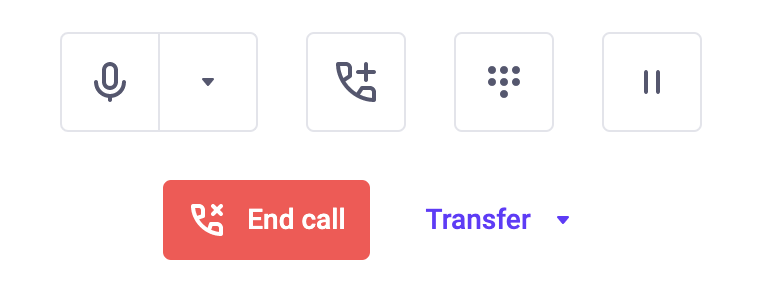
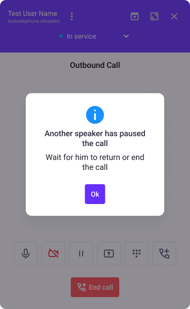
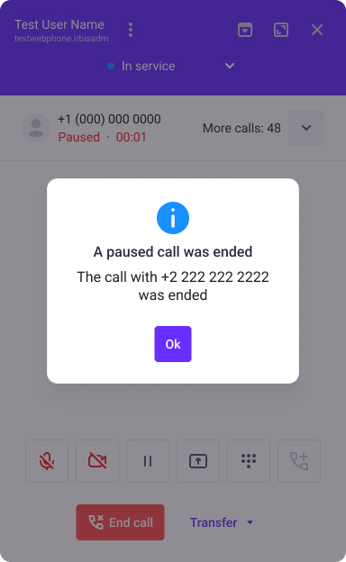
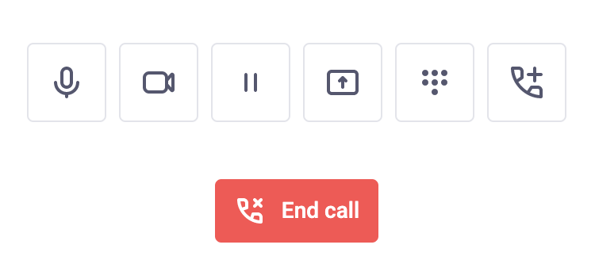
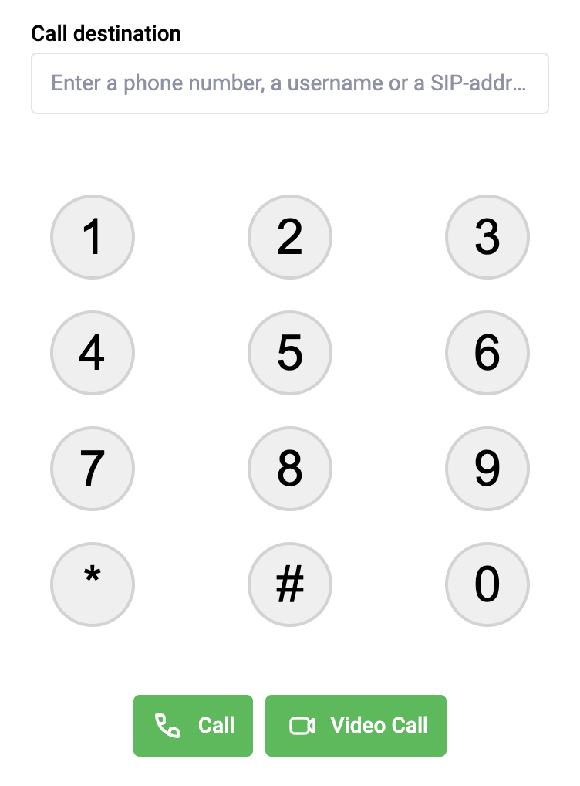
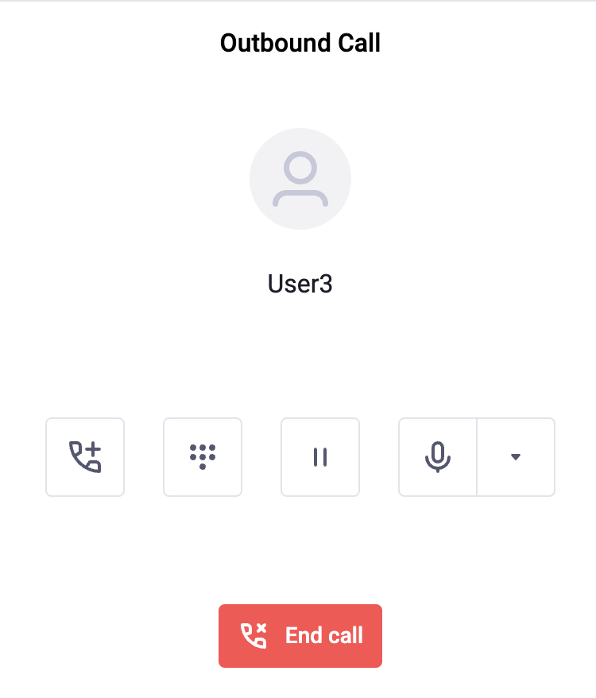
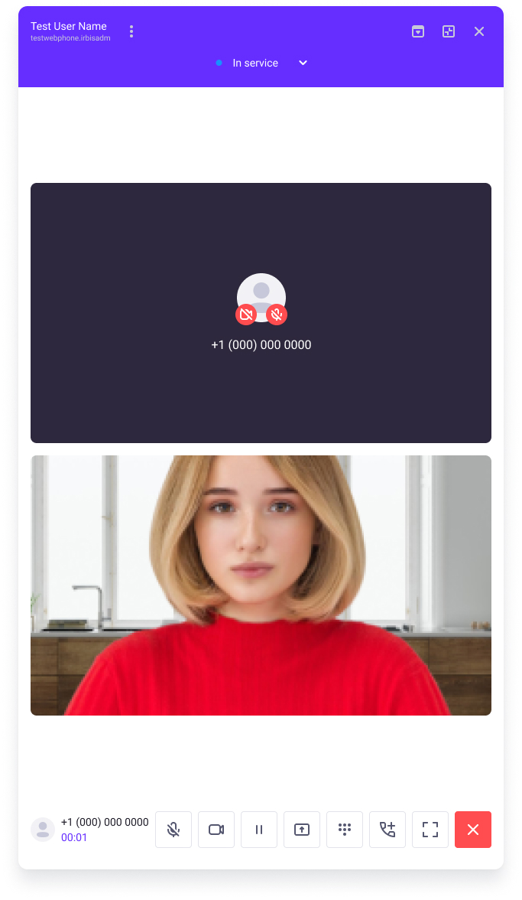

# Voximplant voice & video app for Vue.js

Voximplant voice & video app for Vue.js is a ready-to-use solution to embed Voximplant audio and video experience into a Vue based application, with full customization capabilities. The kit is ready to run as a standalone application or to leverage as a component inside an existing one.

You can use the kit as a softphone, a call-center operator workspace, a dialer in a CRM system and much more!

## Contents

- [Voice & video app features](#voice--video-app-features)
- [Why should I choose this voice & video app](#why-should-i-choose-this-voice--video-app)
- [How to build](#how-to-build)
- [How to setup backend](#how-to-setup-backend)
- [Customization](#customization)

## Voice & video app features

The kit provides the following features:

- Audio & video calls
- Call Voximplant users, SIP addresses and phone numbers
- Choose audio and video devices and disable them
- Use call queues for contact center
- Multiple simultaneous lines
- Mute, hold and call transfer functionality 
- Numpad
- Set status for users in queue (both ACD v1 and SmartQueue)
- Minimized & maximized vues
- Full-screen view
- Screen sharing
- Several video layouts

## Why should I choose this voice & video app

Voximplant voice & video app for Vue.js is a great choice for your business, because: 

- The Vue.js framework makes it easy to build
- Effector.js enables you to leverage any other framework
- Fully customizable 
- Ready to use as a standalone application or leverage as a component inside an application
- All business logic implemented at application store
- Cross-domain iframe API enables reach configuration options and flexibility

Benefits of the voice & video app for Vue.js:

- Rapid deployment — Leverage the call UI components to deploy quickly and easily 
- Optimize development time — Save time going through documentation as all components have embedded SDK functions and a recommended server scenario
- Flexibility — Components can be used for many different scenarios — call center webphones, video calls, CRM diallers & more
- Customizable — Use and adapt any of the components you need

## How to build

1. Make sure that [Node.js](https://nodejs.org) is installed on your computer.
    > XXX uses [Vue 3](https://vuejs.org/guide/introduction.html) for UI and [Effector](https://effector.dev/docs/glossary/) for business logic, but they will install automatically as dependencies.
1. Download the repository.
1. Navigate to the project folder and execute `yarn install` to install the dependencies and set up the project.
1. To compile and run the project, execute `yarn serve`.
1. To compile and minimize for production, execute `yarn build`
1. To lint and fix files, execute `yarn lint`.

## How to setup backend

To use the client, you need to:
1. Create an [application](https://voximplant.com/docs/gettingstarted/basicconcepts/applications) in the Voximplant platform.
1. Create a [user](https://voximplant.com/docs/gettingstarted/basicconcepts/users) to log into the application (or use an existing one).
1. Create a [scenario](https://voximplant.com/docs/gettingstarted/basicconcepts/scenarios) to process the calls logic.

For example, you can use this simple scenario, to process inbound and outbound calls to and from Voximplant users:

```js
VoxEngine.forwardCallToUser(null,true);
```

This one-line scenario is enough if you are going to call Voximplant users only. If you want to process phone calls, user calls and SIP calls in the same scenario, use the following scenario:

```js
VoxEngine.addEventListener(AppEvents.CallAlerting, (e) => {
    // divide SIP calls from Voximplant calls
    if (e.toURI.endsWith("voximplant.com")) {
        // divide phone calls from user calls
        if (e.destination.match (/^[0-9]+$/)) {
            // this is a phone call
            const newCall = VoxEngine.callPSTN(e.destination, callerID); // you must have a confirmed caller id
            VoxEngine.easyProcess(e.call, newCall, () => {});
        } else {
            // this is a user call
            const newCall = VoxEngine.callUser({
                username: e.destination,
                callerid: e.callerid,
                displayName: e.displayName,
                video: false, // set true to allow video calls
                scheme: e.scheme
            });
            VoxEngine.easyProcess(e.call, newCall, () => {});
        }
    } else {
        // this is a SIP call
        const newCall = VoxEngine.callSIP(e.toURI);
        VoxEngine.easyProcess(e.call, newCall, () => {});
    }
});
```

Read more about processing the calls in scenarios in [our documentation](https://voximplant.com/docs/guides/calls/scenario). You can find the information on how to make peer-to-peer user calls, how to confirm a caller ID and how to secure your SIP-calls.

If you are going to use this application as a contact center operator workspace, use the scenario from the [contact center documentation](https://voximplant.com/docs/guides/smartqueue/howto#set-up-a-voxengine-scenario).

After you create the scenario, you can run your application and log into it with an existing Voximplant user.

### Customization

In this section, you will learn how to customize Voximplant voice & video app for Vue. You will also learn more about the components and their structure, functionality and peculiarities.

### App architecture

Scheme description:

```mermaid
graph TD

F[Vue component/HTML element]
H(variable/function/event)
J[(store)]
```

Additionally, the descriptions for data and functions appear at the arrows between blocks.

### Configuration

The Voximplant voice & video app's configuration is stored in the `/src/config.ts` file and contains the following flags:

- `AUDIO_ONLY` — Specifies whether the call should send and receive video, disabling the video components. The default value is **false**.
- `IS_PLATFORM_INTEGRATED` — Specifies whether the app is integrated into platform, adds the close button to the header. The default value is **false**.
- `IS_CUSTOMIZE` — Specifies whether to disable the CSS height and width restrictions, adapting the window size to the content. The default value is **false**.

### Authorization

The SignUp component is responsible for authorization. It consists of the following blocks:

1. The form.scrollbars block has two elements: Inputs and RadioButtonGroup

Each form value is bound to the `$signInFields` store. Filling the Inputs form triggers the `fillForm` event, which updates the `$signInFields` store in `@/store/signIn` with the following parameters: field: field name, value: field value.
Each form interacts with the `$signInErrors` store, each Input has the @blur attribute, which calls `setFieldError` with the field name and rule.
If the rule is not met, the `setError` event triggers, which adds the error text from the errorList to the field in i18n.
The RadioButtonGroup block is responsible for choosing the `queueType` on SDK initialization.

When the component is mounted, the restoreFillForm() method is called, which includes:

- filling forms from the `$signInFields` store or triggering the getLoginData() method which reads the data from sdk_login_data in the local storage
- calling the checkErrors() method which checks the entered data from the localstorage or the store

2. The .button-wrap block

It consists of a Checkbox with its value bound to the fields.remember property in `$signInFields`. If the value is true, it calls the saveLoginData() method saving the authorization data to the sdk_login_data property in the local storage.
The other element is a Button that executes the loginFx method on click, which sends the authorization data to the SDK via sdkLogin(fields). Read more in the [SDK authorization](#sdk-authorization) section.
The login button is not active (isActiveSignIn) if any errors exist in  $signInErrors

Elements markup scheme in `SignUp.vue`

```mermaid
graph TD

A[SignUp.vue] --> B[.button-wrap]
A --> C[.form.scrollbars]
C --> D[Inputs]
C --> E[RadioButtonGroup]
B --> F[Checkbox]
B --> G['Sign in' Button]
```

Interaction of the elements with events and stores:

```mermaid
graph TD

F[Checkbox] -->|field: 'remember', value: Boolean| R("SaveLoginData(SignInFields)")
R --> P("localStorage.setItem(SDK_LOGIN_STORE_KEY)")
G['Sign in' Button] --> H("loginFx()")
H --> |"if value === true"| R
D[Inputs] --> |"fillForm()"| J[($signInFields)]
E[RadioButtonGroup] --> |"fillForm()"| J
H --> S("sdkLogin(fields)")
J --> |"fields = $signInFields"|S
```

#### SDK authorization

The `sdkLogin` method accepts the field values of the `SignInFields` type. This is a source object for the values for the `SignUp.vue` form:
- userName
- accountName
- applicationName
- password
- queueType

The form values provide the login `loginData` in the following format: `${userName}@${applicationName}.${accountName}.${node}.voximplant.com`. 
If the SDK is not initialized yet, the SDK checks audio device access, and if it succeeds, the SDK prepares a configuration file with video containers.
This config is necessary for SDK initialization `await sdkClient.init(params)` and connection to the cloud `sdkClient.connect()`.
Set the active device then login `sdkClient.login()` with the `loginData` and `password` from the field values.
If the login is successful, proceed to the `Dialing.vue` component, otherwise, highlight the incorrect field via the `setError({field, value})` method.

To log out, call the logout method, which disconnects the SDK.

### Calls

#### VoxEngine call scenario

Scenarios are necessary to process the server part of the client. You can read more about scenarios in [our documentation](https://voximplant.com/docs/gettingstarted/basicconcepts/scenarios).

You can use this scenario example for audio and video calls between Voximplant users.

```javascript
VoxEngine.addEventListener(AppEvents.CallAlerting, function (e) {
  const outCall = VoxEngine.callUser(e.destination, e.callerid, e.displayName, null, true, e.scheme);
  VoxEngine.easyProcess(e.call, outCall);
  
  e.call.addEventListener(CallEvents.MessageReceived,(ev)=> {
    const { text } = ev;
    const sendList = ()=> {
      conf.getList().forEach(ep=>{
          ep.sendMessage(JSON.stringify({
            name:'message',
            payload:{
              command: 'changeDisplayName',
              displayNames: Array.from(displayNameMap.entries()).reduce((acc,el)=>{acc[el[0]]=el[1]; return acc},{})
            }
          }));
        })
    }
    try {
      const data = typeof text === 'object'?text:JSON.parse(text);
      if(data && data.command === 'setMyDisplayName') {
        displayNameMap.set(e.call.id(), data.displayName);
        sendList();
      }
      if(data && data.command === 'getDisplayNames'){
        sendList();
      }
    } catch(err) {
      Logger.write(err);
    }
  })
});
```

- CallAlerting is VoxEngine subscribing to an inbound call
- MessageReceived is subscribing to inbound messages between the call participants

#### Dialing a number

The call destination is specified in the Dialing component

1. .dialing-input
When the form changes, the changeInputValue event is triggered and the destination stores in the $phoneInput store.
2. Numpad
When a user interacts with the Numpad buttons, the changeInputValue event is triggered with the pressed button value.
3. .buttons-wrap 
The buttons for audio and video calls, and the recall button which appears when needToShowAdditionalButton is true.

During a call, the 'primary' parameter is passed to the actionOnBtn method, during a video call the createCall() method is triggered with 'video'.

```mermaid
graph TD
A[Dialing.vue] --> B[Numpad]
A --> C[.dialing-input]
A --> D[.buttons-wrap]
C --> |"changeInputValue()"|E[($phoneInput)]
B --> |"changeInputValue()"|E
D --> |type|G("actionOnBtn(type)")
E --> |number|L("createCall()")
G --> |"type === video"|L("createCall()")
```

#### Audio call

If you want to use the softphone for audio calls only, set the `AUDIO_ONLY` parameter to **true** in the `src/config.ts` configuration file.

The `src/components/Call.vue` component is responsible for UI of audio calls. Here is the `Call.vue` elements scheme:

```mermaid
graph TD
    A[Call.vue] --> B[.status]
    A --> D[.service-buttons]
    A --> C[.icon-mic-off]
    M[("$calls[id]")] --> |"params.muted"|C
    N[("$callDuration")] -->|"timeFormat(Duration)"| B
```

The buttons block `.service-buttons` detailed scheme:



```mermaid
graph TD
    D[.service-buttons]
    D --> G["local mute btn"]
    D --> P["newCall btn"]
    D --> R["switchNumpad"]
    D --> O["stop/start Call"]
    D --> I["end call btn"]
    I --> |"hangUp(call ID)"|Y("SDK Call.hangup()")
    G --> |"changeMute(Boolean)"|L[("$settings.mute")]
    P --> |"'newCall'"|J[("$dialingComponentStatus")]
    P --> |"'Dialing'"|K[("$currentComponent")]
    R --> |"'Dialing'"|K
    R --> |"'toneDial'"|J
    O --> |"toggleCallActive(call ID)"|H("SDK  Call.setActive(flag)")
```

##### Outbound call

Call the `createCall(number, video)` method with the following parameters:
- number: String — call destinations
- video: Boolean — specifies whether the call has video

Making an audio call:

1. Create `CallSettings` for the call. Learn more in the [documentation](https://voximplant.com/docs/references/websdk/voximplant/callsettings)
2. Create a call via the sdkClient.call(callSettings) SDK method
3. The number stores in $lastCallNumber
4. The information received from the SDK and the id stores in $calls
5. The call becomes active setActiveCall
6. The openCallState event triggers, changing the page to `Call`
7. The call receives [call events](https://voximplant.com/docs/references/websdk/voximplant/callevents). Learn more in the [Event list](#event-list) section

In case of errors, the component changes to `CallEnded` and shows the error from the `currentSelectCall.status` store.

The softphone can process only one single call.
When you create a call via `createCall`:
1. the active call sets to pause `setCurrentCallAsPaused()`
2. the interlocutor receives the `setActive(false)` event
3. a new call creates `createSdkCall(number, video)`
4. when the [Connected](https://voximplant.com/docs/references/websdk/voximplant/callevents#connected) event triggers, the new call becomes active `call.setActive(true)` and saves into `$currentActiveCallId`

##### Inbound call

If the user have an active call, when the new call's [Connected](https://voximplant.com/docs/references/websdk/voximplant/callevents#connected) event triggers, the old call is set to hold.  
The interlocutor receives the `setActive(false)` event and the following notification:



When the hold call ends, the `setNotificationState('pauseCallEnded');` event triggers and the following notification appears:



To receive inbound calls, subscribe the sdkClient to the `VoxImplant.Events.IncomingCall` event:
- set the active call to the `$calls` store
- set the [call events](https://voximplant.com/docs/references/websdk/voximplant/callevents) the same way as during the new call creation `handleCall()`

#### Receiving a message during a call via `MessageReceived`

To send and receive messages during a call, process the MessageReceived event in the VoxEngine scenario. 
You can see the scenario example in the [VoxEngine call scenario](#voxengine-call-scenario) section.

The `handleMessageReceived()` method is responsible for processing custom events.

Message type list:

- mute — a user mutes the microphone, changing the call's mute parameter, showing the icon-mute icon in the UI
- initState — the call is started. the message contains information on whether the user's audio/video is enabled
- sharing — a user enables screen sharing, changing the calls remoteSharing parameter, changing the video resolution in the UI
- setActive — an interlocutor changes the call hold status
- userBusy — the interlocutor is busy having another active call

#### Video call

The `src/components/VideoCall.vue` component:

```mermaid
graph TD
    A[VideoCall.vue] --> B[.video-container]
    A --> C[VideoCallFooter.vue]
    A -->  E["end call Button"]
    E --> |"hangUp(call ID)"|Y("SDK Call.hangup()")
```

Scheme of the elements inside the `.video-container` block:

```mermaid
graph TD
    B[.video-container] --> L[("$settings.videoMute")]
    B --> R[("$calls[id].params.remoteVideo")]
    B --> S[("$settings.maximize")]
    L --> |FALSE| O[.outgoing-video]
    L --> |TRUE| W[UserWithoutVideo]
    L --> |FALSE| D[DraggableBlock]
    S --> |FALSE| D[DraggableBlock]
    R --> |TRUE| I[.incoming-video]
    R --> |FALSE| W
    I --> |"call.params.muted"|M[.icon-mic-off]
```

Scheme of the `src/components/calls/VideoCallFooter.vue` call control panel:



```mermaid
graph TD
    C[VideoCallFooter.vue] --> V["video Button"]
    C --> T["sharing Button"]
    C --> R[".service-buttons"]
```

The `sharing Button` screen sharing button:

```mermaid
graph TD
    T["sharing Button"] --> |sendTextMessage|Z("SDK Call.sendMessage('sharing', status)")
    T --> |toggleSharingVideo|X[("$settings.sharing")]
    T --> |status|P("toggleRemoteSharingVideo()")
    P --> W(status)
    W --> |TRUE| Y("SDK call?.shareScreen")
    W --> |FALSE| I("SDK call?.stopSharingScreen")
```

The `video Button` video toggle button:

```mermaid
graph TD
    V["video Button"] --> |"toggleLocalVideo({id, status})"|U("SDK Call[id]?.sendVideo(status)")
    V --> |"changeVideoParam(Boolean)"|S("SDK StreamManager.showLocalVideo(Boolean)");
    V --> |"changeVideoMute(Boolean)"|Q[("$settings.videoMute")]
```

The video toggle button in the `.buttons-wrap` block sends the 'video' parameter to the `actionOnBtn(type)` method.
Depending on the parameter, the boolean 'video' parameter is passed to the `createCall()` method. 
This parameter specifies the [video flags](https://voximplant.com/docs/references/websdk/voximplant/videoflags) the SDK receives on making a call.
Enable sending video:

```javascript
const useVideo = {
    sendVideo: video, // sending local video
    receiveVideo: !appConfig.AUDIO_ONLY, // enables receiving video and depends on the audio/video mode
};
```

The `video: true` parameter is stored in $calls.

Take note of the following events while working with remote media in `EndpointAdded`:
- `RemoteMediaAdded` adding a video from a remote side
- `RemoteMediaRemoved` removing the video from the remote side

Inbound `mediaRenderer` from the web SDK event is rendered/removed in/from the div element with the `remote-video` id. 
The `remoteVideo` parameter is added to $calls and the video element styles in the UI change.
You can find the UI variants for video calls in the [Layout components](#layout-components) section.

##### Dragging the local video

For user convenience, you can drag the local video during the video calls. The local video window has 3 positions:

- top right (standard)
- top left
- bottom left


For dragging the video window we use the [vue-draggable-next](https://www.npmjs.com/package/vue-draggable-next) library.

The draggable block is in the `DraggableBlock.vue` component. We use [Teleport](https://vuejs.org/guide/built-ins/teleport.html) to place the local video `.outgoing-video`.

The video slots have the `.stub` class. When the `startDrag` event triggers, the `VueDraggableNext` component changes its class to `slot-active`.

### Queues

Task queues are necessary for contact center to distribute calls and conversations. You can read more about queues and contact center in [our documentation](https://voximplant.com/docs/guides/smartqueue).

The list of all active calls displays in the `src/components/calls/ActiveCall.vue` list.

#### Operator statuses

After the authorization `sdkLogin()` depending on the queue type `$signInFields.queueType` the SDK is queued for the [queue status](https://voximplant.com/docs/references/websdk/voximplant/operatoracdstatuses).

- if the queue type is QueueType.SmartQueue [sdkClient.getOperatorSQMessagingStatus()](https://voximplant.com/docs/references/websdk/voximplant/client#getoperatorsqmessagingstatus)
- if the queue type is QueueType.ACD [sdkClient.getOperatorACDStatus()](https://voximplant.com/docs/references/websdk/voximplant/client#getoperatoracdstatus)

The status is stored in `$queueStatus`
When the [ACDStatusUpdated](https://voximplant.com/docs/references/websdk/voximplant/events#acdstatusupdated) event triggers, `$queueStatus` changes via the `setQueueStatus` event.
You can set the status manually via the `setSdkQueueStatus(status)` method with the desired status.
The default queue type is `None`, and the default status is [Online](https://voximplant.com/docs/references/websdk/voximplant/operatoracdstatuses#online)

The 'Banned' status has a special UI banner. You can control the banned status via the `toggleBannedStatus` event in the `$isBannedStatus` store.


### Call transfers

The softphone cannot make blind transfers. Use only transfers with confirmation. You need to have a connected call with the user to whom you want to transfer the call.

By default, transfers are available only for audio calls. It means that the `AUDIO_ONLY` flag should have the **true** value in `src/config.ts`.

Use the `transferCall(String)` method to transfer the call, which executes the [Client.transferCall(call1, call2)](https://voximplant.com/docs/references/websdk/voximplant/client#transfercall) method, where:

- call1, is the call from $call that needs to be transferred
- call2, is the current active call to be transferred

After the transfer, the active component switches to `Info.vue` with the notice about the transferred call in  `$infoComponentStatus`.
The last transferred calls are stored in `$lastTransferredCallNumbers`

### Event handling 

#### Event handling customization

You can change the event handling by changing the handlers' code.
For example, when a call is put on hold, open the `Dialing` component with a `newCall` status:

```javascript
call.on(VoxImplant.CallEvents.ActiveUpdated, ({ call, new: newValue }: EventHandlers.ActiveUpdated) => {
  if (newValue) {
    // when call continue
  } else {
    changeComponent('Dialing'); // open Dialing component
    changeComponentDialingStatus('newCall'); // set "newCall" status
  }
  setCall({ id, call, params: { video } });
});
```

#### Event list:

- [MicAccessResult](https://voximplant.com/docs/references/websdk/voximplant/events#micaccessresult)
Subscription to the microphone access. The SDK returns `true` if the access is granted, or `false` otherwise. The result of this event is stored in `$softphoneParameters.micAccessResult.`
Since one cannot call without microphone access, the user will be redirected to the `Info` page with a request to grant access to the microphone.

- [EndpointAdded](https://voximplant.com/docs/references/websdk/voximplant/callevents#endpointadded)
A remote user connects to the call. Includes the subscriptions to process remote media, works only for video calls.
- [RemoteMediaAdded](https://voximplant.com/docs/references/websdk/voximplant/endpointevents#remotemediaadded) adds a video element with remote media to `.incoming-video`.
- [RemoteMediaRemoved](https://voximplant.com/docs/references/websdk/voximplant/endpointevents#remotemediaremoved) removes the remote media

- [Connected](https://voximplant.com/docs/references/websdk/voximplant/callevents#connected) 
The call is connected successfully, and the call is stored in `$calls`. Sets up the initial parameters (`audioMute` и `videoMute`).

- [Disconnected](https://voximplant.com/docs/references/websdk/voximplant/callevents#disconnected) 
The call is disconnected, the camera is turned off and the call is removed from `$calls`.

- [Failed](https://voximplant.com/docs/references/websdk/voximplant/callevents#failed)
The call failed. Pauses the ringtone, the error status code is stored in `currentActiveCall.status`

- [ActiveUpdated](https://voximplant.com/docs/references/websdk/voximplant/callevents#activeupdated)
The hold status of the active call is changed. You can remove this event if you do not support call holding in your application.

- [MessageReceived](https://voximplant.com/docs/references/websdk/voximplant/callevents#messagereceived) 
A new message is received. Process `MessageReceived` to create your events and create handlers.

Implemented messages in the softphone:

- `mute` toggling the microphone, stored in the `mute` parameter of the current call, an icon is displayed in the UI.
- `initState` initial call state, such as sending and receiving the video.
- `sharing` toggling screen sharing, stored in the `sharing` parameter of the current call, changing the grid in the UI.
- `setActive` holding the call from the interlocuter side
- `userBusy` indicating that your interlocuter is having an active call when unholding your call

The messages are sent via the `sendTextMessage` method in `src/lib/sdkSource.ts` with `JSON.stringify(data)`, where `data` is:

```javascript
const data = {
    name: 'eventName',
  // value for your event
};
```

You can change or remove the subscription to these events.

## Customization

### UI styles customization

You can customize the styles of all components in the `<style>` section of the code. CSS only applies to the current component elements (`scoped`).

### UI blocks and components customization

Videoconf uses the SpaceUI library. Here we explain how to customize the components of this library.
For example, let us customize the `.service-buttons` block in the `src/components/Call.vue` component.

#### Block customization

You can customize the block by changing or adding class styles. For example, we need to show the block as a column and move it to the right top corner. Also, we want to remove the microphone button.

1. Make the block a column and place it on the top right button with 10px offset.

```css
.service-buttons {
    ...
    position: absolute;
    top: 10px;
    right: 10px;
}
```

2. Remove the microphone button.

```vue
// template(#last-side)
  Button(
    ...
  )
```

Let us take a look at the result.


#### Component customization

Let us customize one of the buttons in this block.

Find the Button component. Here is how it looks in the code (the Call.vue component):

```vue
Button.button(
    mode="outlined"
    iconOnly
    size="l"
    :icon="{name: 'ic20-numbers', width: '20px', height: '20px'}"
    @click="switchNumpad"
)
```

`Button` is a SpaceUI component, and `.button` is a CSS class.

Pass the necessary properties into the brackets. It changes the component.

The list of applied properties is available in the `spaceui.d.ts` file. You can find it in the SpaceUI library folder within node_modules.

Find the Button class:

```ts
export declare class Button extends Vue {
  size?: ButtonSize;
  width?: ButtonWidth;
  icon?: IconProp;
  mode: ButtonMode;
  loading?: boolean;
  hideText?: boolean;
  // default slot
  default?: string;
}
```

Step by step:

* `size` - specifies the button size. Besides `l`, it accepts `s` and `m` values.
  `s` - small, `m` - medium, `l` - large.

* `width` - specifies the maximum button width and accepts one of the following values:  
  1)`fill-container` - the width fills the container  
  2)`fit-content` - the width fits the content

* `icon` - specifies the button icon in the SVG format.  
  Find the `IconProp` type to see what values it accepts:

```ts
export type IconProp = string | Icon;
```

Find the `Icon` class. It accepts an object with the following properties:

```ts
export declare class Icon extends Vue {
  spriteUrl?: string;
  name: string;
  color?: string;
  size?: string | number;
  width?: string | number;
  height?: string | number;
}
```

`spriteUrl` accepts the path to the icon sprite  
`name` accepts the icon's id

Let us return to the `Button`'s properties

* `height` - is an HTML attribute
* `mode` - specifies the button's color style. for example, `warning` makes the button red and `flat` makes it transparent.
* `loading` - enables the loader icon
* `hideText` - hides the button text
* `default` - specifies if we can use the slot.
  It is necessary if we want to put something except a text string inside the button, for example, an HTML tag (div, p, span), specify a CSS class, or even insert another component.

You can use Vue-directives (v-if, v-for, v-on etc.)
In the example, the Button component has the following directive: `@click="switchNumpad"`. Vue allows binding multiple event handlers (click, keyup, submit, etc).  
`switchNumpad` - is a function that executes on the button's click. if you want to change the function, you can add your code to it. Alternatively, you can write a function decorator for `switchNumpad` and use it. See an example of how to do it.

Let us change the button.

```vue
Button.button(
  mode="primary"
  iconOnly
  size="s"
  :icon="{name: 'ic20-numbers', width: '25px', height: '25px', color: 'white'}"
  @click="switchNumpad"
)
```

Here is the new Numpad opening button:


If the [SpaceUI](https://www.npmjs.com/package/@voximplant/spaceui) capabilities are not enough, you can create your CSS class for the component and make your styles.
Let us add a `numpad-button` class and write our styles.

```vue
Button.button.numpad-button((...
```

```postcss
& .wrap {
    & .numpad-button{
        margin: 20px auto;
        border: 2px solid lightgray;
        border-radius: 20px;
    }
}
```

Let us see the result:


Now let us improve the functionality. As you can see, the button click calls the `switchNumpad` function.  
Here it is:

```javascript
const switchNumpad = () => {
    changeComponent('Dialing');
    changeComponentDialingStatus('toneDial');
};
```

Let us create an abstract function that sends some data to a remote server:

```javascript
const getData = (async () => {
    const response = await fetch(`https://website.com/api`, {
      method: 'POST',
      body: data
    });
    const json = await response.json();
    if (response.status !== 200) throw Error(json.message);
    return json;
});
```

And add this function to `switchNumpad`:

```javascript
const switchNumpad = () => {
    changeComponent('Dialing');
    changeComponentDialingStatus('toneDial');
    getData();
};
```

Now, in addition to opening the numpad, we send some data to a server.

### Layout components

#### Replacing or removing components

##### Removing a component

For example, let us remove the Numpad.vue component. Find it in the `src/components/Dialing.vue` component.
Remove it from the `template`. Input also uses the `changeInputValue` onclick function, so leave it as it is.
The `numpadList` variable is not used, you can delete it `src/lib/numpadButtonList.ts`.

##### Replacing a component

Remove the Numpad.vue component as it was explained above. Then add some other component that needs to be displayed in the normal and minimized softphone version.

```vue
  //Numpad.numpad-dialing(...)
  MyNumpad(v-if="!settingsState.minimize")
```

In the`MyNumpad.vue` component, let us add buttons from the `numpadList` array to `src/lib/numpadButtonList.ts` and add some styles.

```vue
<template>
  <div id="numpad">
    <button v-for="item in numpadList">{{ item.number }}</button>
  </div>
</template>

<script lang="ts">
import {defineComponent} from "vue";
import {numpadList} from "@/lib/numpadButtonList";

export default defineComponent({
  name: "MyNumpad",
  setup() {
    return{
      numpadList
    }
  }
})
</script>
<style scoped>
#numpad {
  display: grid;
  margin: 10px;
  gap: 20px;
  grid-template-columns: 1fr 1fr 1fr;

  button {
    cursor: pointer;
    border-radius: 50%;
    width: 55px;
    height: 55px;
    border: 2px solid lightgray;
    margin: auto;
    outline: none;
    font-size: 2rem;

    &:active {
      border-width: 2px;
      transform: scale(0.99);
    }
  }
}
</style>
```

This is what it looks like:



Now apply the functionality. Let us call an event on clicking the button.
Add an `onClickNumpadButton` event with passing the value on clicking the button.

```vue
<button v-for="item in numpadList" @click="onClickNumpadButton(item.number)">{{ item.number }}</button>
```

Then write a js function that adds the clicked button to `$phoneInput`:

```javascript
setup() {
    const phoneInput = useStore($phoneInput);
    const onClickNumpadButton = (key: number) => {
        changeInputValue({ value: phoneInput.value.inputValue + key, event: 'change' })
    };
    return {
        numpadList,
        onClickNumpadButton
    }
}
```

Pressing the button adds the `item.number` to `$phoneInput` and to the corresponding Input.
You can send data from the `MyNumpad.vue` to the parent `Dialing.vue` component:

```javascript
emits: ['click'], 
setup(props, { emit }) {
    const onClickNumpadButton = (key: number) => {
        emit('click', key);
    };
    return {
        numpadList,
        onClickNumpadButton
    }
}
```

And then implement changing `$phoneInput` in the `Dialing.vue` compnonent:

```vue
MyNumpad(
  v-if="!settingsState.minimize" 
  @click="(value) => changeInputValue({ value, event: 'input' })"
)
```

#### Changing the position of the components

For example, let us take the button panel in the src/components/Call.vue component. 
Take a button you want to change the position, for example, the audio button. Move `SplitButton` from the beginning of the `.service-buttons` block to its end:

```vue
.service-buttons(v-if="!settingsState.minimize")
    Button.button(...)
    Button.button(...)
    SplitButton.button
      template(#first-side)
        Button.button-left(...)
      template(#last-side)
        Button.button-right(...)
```

The `SplitButton` is not the first anymore, that is why we need to remove the `min-width` style:

```postcss
& .button {
    /*min-width: 96px;*/
    &:not(:first-child) {
        margin-left: 24px;
        min-width: 48px;
    }
}
```

Here is the result:



#### Advanced: How to change the video layout

Local video:

- `outgoingVideoClasses` your local video
  - `show-all-container` if the remote video is off, show the local video fullscreen  
  
  - `show-to-window` remote video is full screen, the local video is in a separate window to the right  
  
  - `maximize-container` when the softphone is maximized, the video is shown one by one, and the local video is to the left  
  

- `outgoingBlockClasses` local video styles
  - `hide-block` if there is no local video, the block is hidden  
  

Remote video:

- `incomingVideoClasses` styles when the remote video is present
  - `show-all-container` show fullscreen  
  
  - `maximize-container` when the softphone is maximized, the video is shown one by one, and the local video is to the left  
  
  - `second-column` when the softphone is maximized, place the remote video to the center if the local video is not present  
  

- `incomingBlockClasses` remote video block styles
  - `show-all-container` if the remote video is present, show it fullscreen  
  
  - `show-to-window` no remote video present, but the local video is present, show the information about the remote user to the right top  
  
  - `hide-video` no remote video present. If the local video is present, hide the block, if it is not, show the placeholder `UserWithoutVideo`  
  
  - `maximize-block` when the softphone is maximized, the video is shown one by one, and the local video is to the left  
  
  - `second-column` when the softphone is maximized, place the remote video to the center if the local video is not present  
  

Common video blocks styles
The computed `getClass` is responsible for video block styles. It changes depending on:
1. minimized/maximized softphone `settings.value.maximize`
2. the number of video columns in maximized mode `settings.value.videoMute`
3. remoteSharing is enabled/disabled and the resolution of the screen shared

The `one-column-video` or `two-column-video` classes are applied if the softphone is maximized, depending on whether the local video is enabled.
When the remote user shares their screen, the `remote-sharing` class is added, the remote video size maximizes to full screen, and the local video minimizes to a small video at the top right corner.

##### Layout customization

This mode suits only the maximized mode. If you want to make the video block bigger, change the `remote-sharing` applying conditions:

```javascript
const getClass = computed(() => ({
  // some classes
  'remote-sharing': settings.value.maximize && myConditions,
}));
```

Where `myConditions` is a Boolean with your condition. 

When the softphone is maximized, the layout updates depending on your screen size. If the screen width is less than 1183 pixels, the videos will stack vertically:



You can change this by editing the `.two-column-video` class.
For example, let us change the first video width to `65%`, and the screen width to `1450px`:

```postcss
.two-column-video {
  grid-template-columns: 65% 35%;
  @media (width < 1450px) {
    grid-template-columns: 100% !important;
    grid-template-rows: 50% 50% !important;
  }
}
```

To increase screen sharing size, change the `.remote-sharing` size in CSS. For example, let us increase the remote video to 85% and decrease the local one to 14%:

```postcss
.remote-sharing {
  grid-template-columns: 85% 14%; // leave 1-2% for avoid cropping 16/9 video
}
```

### Choosing the call mode

#### Embeddable softphone

If you only need to use audio calls:

1. In `src/config.ts`, set the `AUDIO_ONLY` flag to **true**
2. Remove components and keep only audio, numpad, lines, transfers, hold, and mute.

Also, remove the video parameters from the types, you can find them in `src/types/index.ts`.
Remove the `src/components/VideoCall.vue` component and `case 'transferredVideoCall'` redirects to this component in `src/store/components/init.ts`.
Remove the video parameters and devices from `src/store/calls`:

- video from $calls.params
- changeVideoDevice
- toggleLocalVideo
- toggleRemoteVideo
- toggleRemoteSharingVideo

In `src/store/settings`:

- addActiveVideoDevice
- changeVideoMute
- toggleSharingVideo
- toggleRemoteSharing
- videoDevices

If you do not need the extended mode, delete the settings and events responsible for this mode:

- maximize
- fullscreen
- toggleMaximize
- toggleFullScreen

Delete the button for this mode in `Header.vue`:

```vue
Hint.tooltip(:text="settingsState.maximize ? t('hints.buttonExpand') : t('hints.buttonMaximize')")
  Button.collapse(:icon="getMaximizeIcon" @click="toggleMaximize")
 ```

Since we do not use the video functionality, you can remove the video functions from `src/lib/sdkSource.ts`:
- changeVideoParam toggle local video
- useVideo sending video flags on call initialization
- changeComponent('VideoCall') set Call only
- RemoteMediaAdded and RemoteMediaRemoved events
- toggleRemoteVideo and toggleRemoteSharing in MessageReceived
- remoteVideoContainerId from params and addActiveVideoDevice on SDK login

Remove the visual video elements that appear based on the `isVideoCall` parameter in `IncomingCall.vue` and `Header.vue`.
Result: we removed the video functional and the softphone's fullscreen mode.

#### Video platforms

Remove the numpad, and lines, hold, keep audio/video switching, and keep the extended video. The `AUDIO_ONLY` flag should be set to **false** in `src/config.ts`.

In addition to removing unnecessary functionality, remove unnecessary parameters from types, such as lines, hold, and so on. You can find them in `src/types/index.ts`.
You can find the info on how to remove numpad in the [Replacing or removing components](#replacing-or-removing-components) section.
To remove information about lines in `Call.vue` and `CallFooter.vue` delete the following lines:

```vue
  transition(name="fade")
        DropdownList.transfer-dropdown(v-if="isOpenSelect")
          ul.select-list
            li.list-item(
              v-for="(item, key) in calls"
              :key="key"
              @click="transferCall(item.id)"
            )
              CallInfo(:callData="item")
```

As the call transfer is not used, remove it from Effector.
Remove the transferCall eventfrom `src/store/calls` and the transfer `transferSdkCall` method from `sdkSource.ts`.

To remove the call holding from `Call.vue` and `CallFooter.vue` remove the call holding button and create a new line:

```vue
Button.button(
  mode="outlined"
  iconOnly
  size="l"
  :icon="activeCall.active ? 'ic24-pause' : 'ic24-play'"
  @click="toggleCallActive({ id: activeCall.id })"
)
Button.button(
  mode="outlined"
  iconOnly
  size="l"
  :icon="{name: 'ic20-numbers', width: '20px', height: '20px'}"
  @click="switchNumpad"
)
```

As the call holding and creating a new line is not used, remove it from Effector.
Remove the event initialization from `src/store/calls/`. Remove creating multiple lines from `src/store/softphone/init.ts`:

```javascript
if (store === 'toneDial') {
    if (type === 'primary' || type === 'video') {
      const currentCall = currentActiveCall.getState();
      if (currentCall) {
        hangUp({ id: currentCall.id });
      }
    } else {
      changeComponentDialingStatus('newCall');
    }
  }
  if (store === 'newCall') {
    const currentId = currentActiveCall.getState()?.id;
    if (currentId) {
      toggleCallActive({ id: currentId });
    }
    createCall({ number: $phoneInput.getState().inputValue, video: video });
}
```

Remove the `toneDial` and `newCall` statuses and their usage.
Then you can extend and customize the functionality of the layouts and fullscreen mode. You can find the information on how to do it in the [Advanced: How to change the video layout](#advanced-how-to-change-the-video-layout) section.
If you want to use the maximized softphone only, set the `maximize: true` parameter in the `$settings` store.

Result: we removed call transfers and switching between lines, keeping simple audio and video calls and making the maximized softphone by default.
